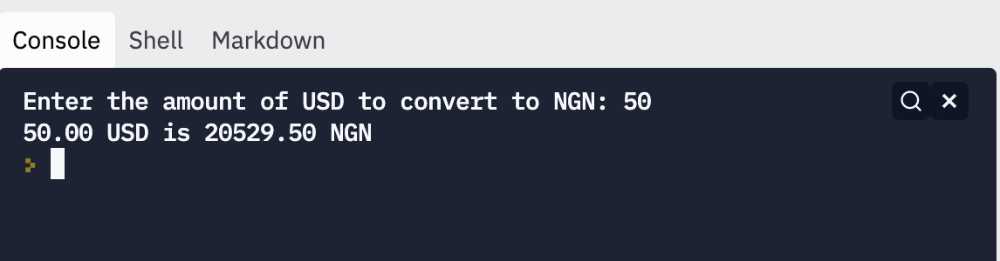

# Currency Conversion: Instructions

In this exercise, you'll help the user convert currency from US Dollars to Naira.

Write a program that prompts the user for a USD value, and outputs the value, converted to NGN.

1. Use `input` to get the USD value from the user.

2. Convert the USD value to NGN by multiplying it by the exchange rate.

3. Print out the NGN value (formatted with 2 decimal points).

The starter code specifies the exchange rate to use: 

```python
NAIRA_PER_DOLLAR = 410.59 # exchange rate as of Nov 10 2021 
```

Run the tests to check that your solution is correct.

Here's a sample run of the program you are aiming to reproduce:



## Hints

1. The tests are picky about exactly what you print out! Pay special attention to your `print` statements, so that your code is exactly right.

2. To format the decimals in the numbers correctly, you can use an *f-string*, like this: `print(f"{value:.2f} NGN")`.